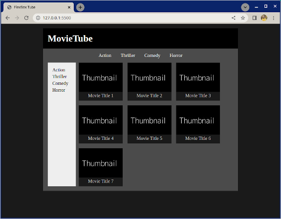
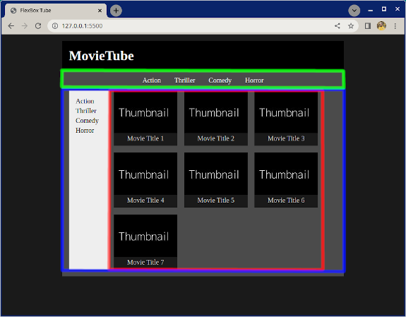
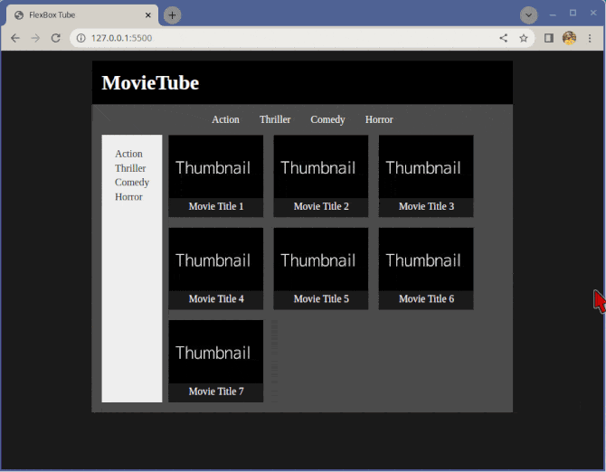

# Flexbox Tube

This exercise is about practicing `flex-wrap` and general layouting with nested flexboxes.

## What you will be doing

Create the layout of the page as seen in the reference image below. Use images from the `images` folder.

## Tasks

### Task 1

- Examine the reference image
- Think about what elements and containers you might have
- Add the the basic HTML structure you think you might need for page
- For reference:
    - Use the included the included [Thumbnail image](./images/thumbnail.jpg)
    - All text is black or white
    - The background shades of gray are
        - Main background: #1a1a1a
        - MovieTube heading background: #000000
        - Content area background: #4b4b4b
        - Sidebar background: #eeeeee
        - Movie card/title background: #1a1a1a

### Task 2

- Make the highlighted elements in the image below flex containers
    - Green flex container for the genre selection on the top
    - Blue flex container for the sidebar and movie list
    - Red flex container for the movie list
        - Note that the red flex container is inside the blue

            

Each individual movie card inside the movie list container is also a flex container to get the thumbnail and movie aligned.

### Task 3

- Implement the page to look and work as close as you can to the reference animation

    

### Optional bonus task

- For fun you can also add actual movie names and posters!

[//]: # (autograding info start)
#  Results
> ⌛ Give it a minute. As long as you see the orange dot  on top, CodeBuddy is still processing. Refresh this page to see it's current status.
>
> This is what CodeBuddy found when running your code. It is to show you what you have achieved and to give you hints on how to complete the exercise.

### Layout

|                 Status                  | Check                                                                                    |
| :-------------------------------------: | :--------------------------------------------------------------------------------------- |
|  | Three flex containers are present |
|  | Thumbnails are arranged in 3 columns |
|  | Sidebar with menu items is present |

### Colors

|                 Status                  | Check                                                                                    |
| :-------------------------------------: | :--------------------------------------------------------------------------------------- |
|  | background of logo should be `#000`  |
|  | background of thumbnail should be `#1a1a1a`  |
|  | background of thumbnail container should be `#4b4b4b`  |

[🔬 Results Details](../../actions)
[🐞 Tips on Debugging](https://github.com/DCI-EdTech/autograding-setup/wiki/How-to-work-with-CodeBuddy)
[📢 Report Problem](https://docs.google.com/forms/d/e/1FAIpQLSfS8wPh6bCMTLF2wmjiE5_UhPiOEnubEwwPLN_M8zTCjx5qbg/viewform?usp=pp_url&entry.652569746=UIB_layout_laying_out_fullpage)

[//]: # (autograding info end)