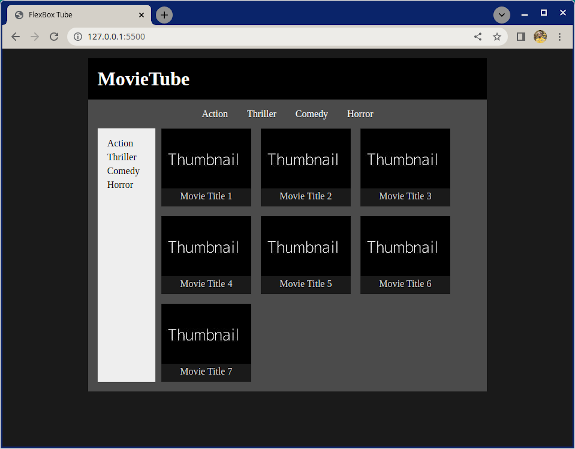

# Flexbox Tube

Dieses Übung ist zum Üben von `flex-wrap` und allgemeinem Layouting mit verschachtelten Flexboxen.

## Was du tun wirst

Erstelle das Layout der Seite, wie es im folgenden Referenzbild zu sehen ist. Verwende die Bilder aus dem Ordner `images`.

## Aufgaben

### Aufgabe 1

- Untersuche das Referenzbild
- Überlege, welche Elemente und Container du benötigen könntest
- Füge die grundlegende HTML-Struktur hinzu, die du für die Seite benötigst
- Als Referenz:
    - Verwende das enthaltene [Thumbnail-Bild](./images/thumbnail.jpg)
    - Der gesamte Text ist schwarz oder weiß
    - Die Hintergrundfarben in Grautönen sind:
        - Haupt-Hintergrund: #1a1a1a
        - MovieTube-Überschrift Hintergrund: #000000
        - Inhaltsbereich Hintergrund:
        - Seitenleiste Hintergrund: #eeeeee
        - Filmkarte/Titel Hintergrund: #1a1a1a

### Aufgabe 2

- Mache die im Bild unten hervorgehobenen Elemente zu Flex-Containern
    - Grüner Flex-Container für die Genre-Auswahl oben
    - Blauer Flex-Container für die Seitenleiste und die Filmliste
    - Roter Flex-Container für die Filmliste
        - Beachte, dass der rote Flex-Container im blauen enthalten ist

            

Jede einzelne Filmkarte innerhalb des Filmlisten-Containers ist ebenfalls ein Flex-Container, um das Thumbnail und den Film auszurichten.

### Aufgabe 3

- Implementiere die Seite so, dass sie so nah wie möglich an der Referenzanimation aussieht und funktioniert

    

### Optionale Bonusaufgabe

- Zum Spaß kannst du auch echte Filmtitel und Poster hinzufügen!